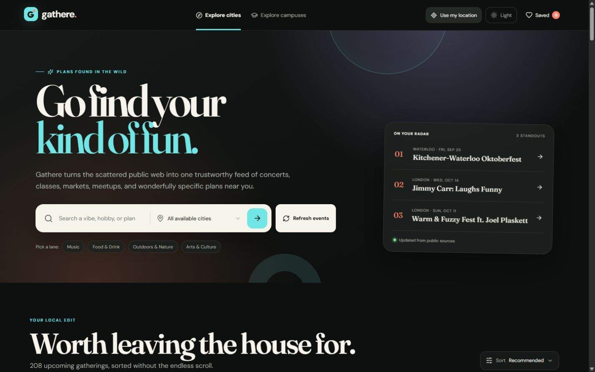
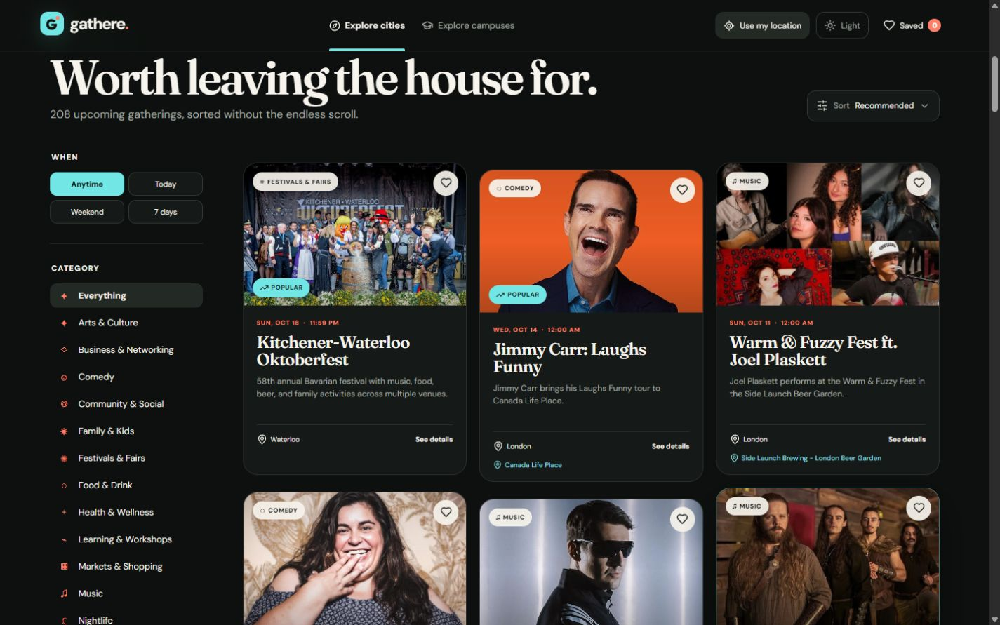
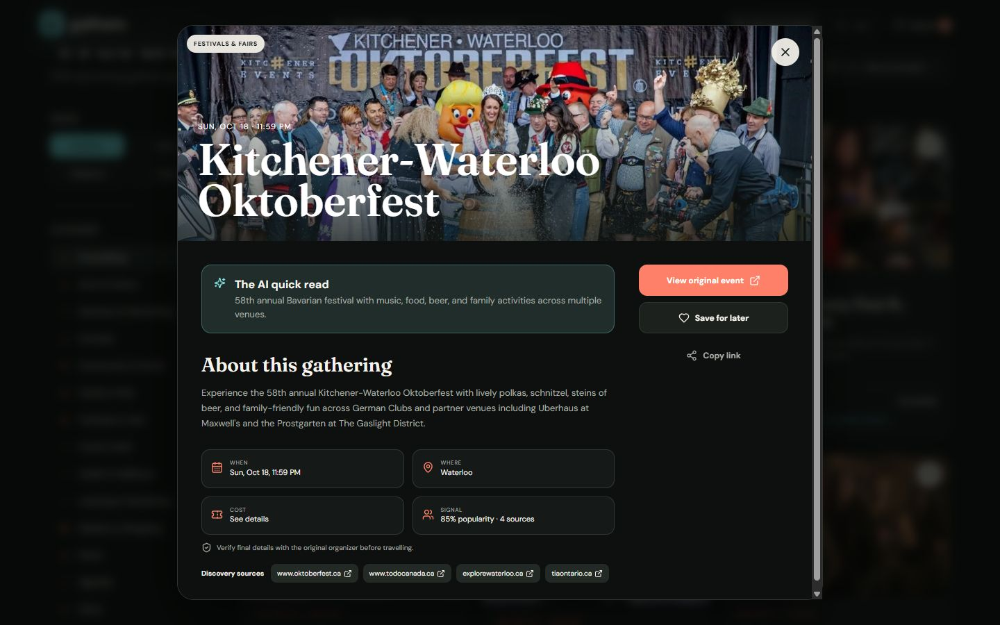
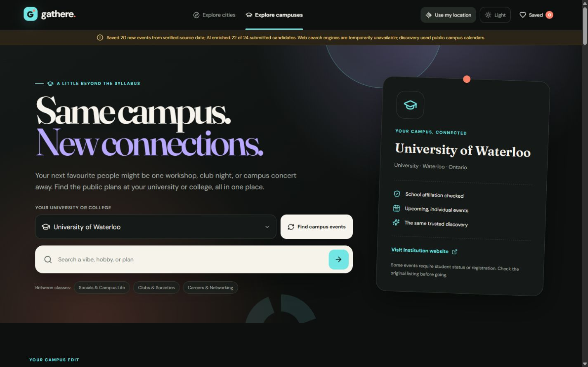
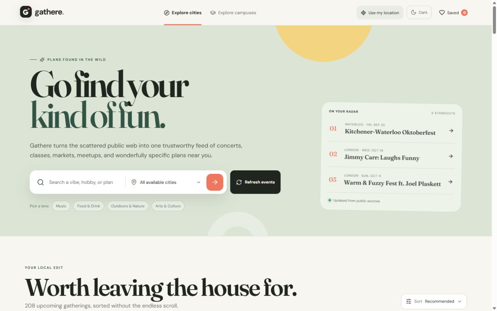
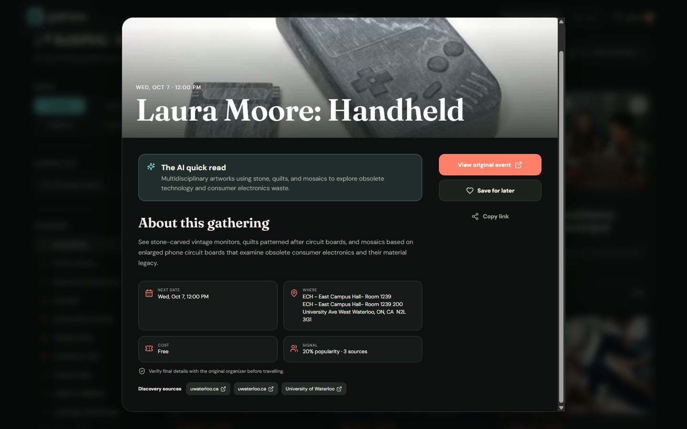
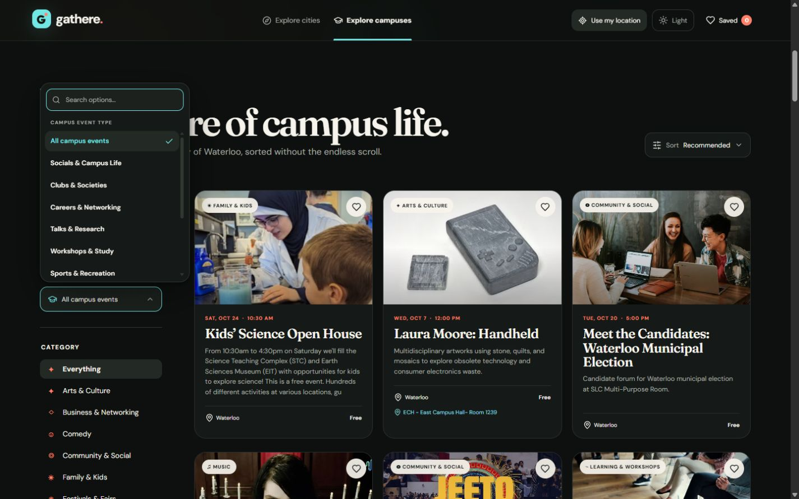

# Gathere

### Go find your kind of fun.

Gathere is my full-stack event-discovery demo. It turns scattered public calendars,
event pages, and accessible social posts into a source-backed feed of plans.
Events are discovered rather than dependent on user submissions, normalized into
PostgreSQL, and enriched with AI for a concise, useful read.

**Python · FastAPI · React · TypeScript · PostgreSQL · Docker · SearXNG**

This is a **portfolio showcase**, not the application source repository.
I maintain the implementation privately. For a walkthrough or recruitment
discussion, [contact me on GitHub](https://github.com/ArshaFazlollahi).

## The experience

- **Explore cities:** search by interest and city, with date, category, cost,
  popularity, relevance, upcoming-date, and opt-in location sorting.
- **Explore campuses:** a distinct campus noticeboard and searchable catalog of
  48 Ontario universities and colleges, with campus-life filters. Campus-affiliated
  listings stay separate from the city feed.
- **Understand a plan quickly:** event-specific titles, short descriptions,
  locations, pricing where available, upcoming occurrences, and original sources.
- **Save something for later:** saved events, detail views, and shareable links.
- **A considered interface:** dark-first cyan-and-coral identity, a light theme,
  custom dropdowns, and responsive layouts.
- **Bounded discovery:** visible refresh progress, quota-aware AI routing, and
  source-verified fallback records when enrichment is unavailable.

The brand is geography-neutral; the current ingestion configuration covers Ontario.
Coverage is not exhaustive and depends on what publishers expose publicly.

## Screenshots

I captured these screenshots from the running local demo using a **1440 × 900
desktop landscape viewport**. They are unaltered captures, not design mockups.
Open an image to view the full-resolution capture.

| Event feed | Event details |
| --- | --- |
|  |  |

| Campus discovery | Light theme |
| --- | --- |
|  |  |

| Source transparency | Campus event types |
| --- | --- |
|  |  |

See [capture notes and image credits](docs/screenshots.md).

## Engineering highlights

I separated public-source discovery, source verification, AI
enrichment, relational persistence, and fast user-facing lookup. Verified facts
are retained even when a model or search provider fails.

Notable challenges included distinguishing list articles from individual events,
preserving explicit recurring schedules, cross-source deduplication, isolating
campus affiliations, recovering from AI output truncation, and assigning varied
but topic-appropriate stock thumbnails when official images are unavailable.

[High-level architecture](docs/architecture.md) ·
[Engineering case study](docs/case-study.md) ·
[Verification record](docs/verification.md)

## Verification snapshot

At my latest implementation checkpoint, 369 backend tests were covered:
368 passed in the main run, and one Windows-mounted SQLite setup failure passed
on an isolated rerun. All 24 frontend tests passed, and the production frontend
build passed. These are development checks, not a claim of complete test coverage
or production readiness. See the [verification notes](docs/verification.md).

## Demo scope and responsible discovery

I run this as a local Docker Compose demo, not a publicly hosted service. The public
showcase cannot be used to run the application. Live discovery uses permitted
public content; it does not bypass private accounts, logins, or anti-bot challenges.
Public social coverage is limited by accessibility and indexing. Provider quotas,
availability, and source layouts can change. Users should verify final event
details with the organizer before travelling or buying tickets.

I developed the project iteratively with AI-assisted tooling, using regression
tests and manual checks to assess the implementation. I do not publish private
source, credentials, database exports, logs, or extraction recipes in this showcase.

## Rights

I offer my original showcase content for portfolio evaluation under the
[Gathere Showcase Evaluation License](LICENSE). This is not an open-source release
and does not grant a general right to reuse the implementation or original assets.
Third-party images, logos, and event information retain their respective rights.
The notice does not revoke previously granted licenses or claim ownership of
general product ideas. See [third-party notices](NOTICE.md).
