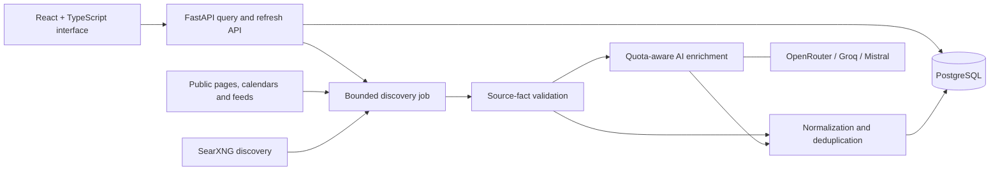

# High-level architecture

This is a system overview, not an implementation guide or extraction recipe.

## Responsibilities

| Layer | Responsibility |
| --- | --- |
| React interface | Separate city/campus views, accessible custom controls, filters, saved events, detail views, themes, and refresh progress |
| FastAPI service | Typed requests and responses, event lookup, feed isolation, discovery status, and bounded refresh orchestration |
| Public-source discovery | Collect permitted pages and feeds; follow a limited number of relevant detail pages; retain partial progress when sources fail |
| Verification and normalization | Distinguish individual events, validate explicit source facts, preserve provenance, standardize categories and schedules |
| AI routing | Enrich text with ranked model/provider choices, handle exhaustion and failures, and limit requests and output size |
| PostgreSQL | Relational event, place, category, occurrence, source, and campus-affiliation data for fast subsequent queries |
| Docker Compose | Reproducible local services, persistent database storage, local SearXNG, and optional database inspection with pgAdmin |

## Important boundaries

Verified publisher facts are persisted independently of successful AI enrichment.
AI is not treated as an authoritative source of dates or event identity.
Multiple source listings can refer to one event with several occurrences, while
distinct activities from a calendar or article remain separate records.

Campus affiliation requires source evidence rather than geographic proximity.
Feed separation is enforced at lookup and persistence boundaries, not merely by
hiding a card in the browser. Location-based city discovery is opt-in.

The thumbnail policy prefers a usable official image; otherwise it selects an
appropriate illustrative photo from a curated catalog. Topic fit and distribution
matter together, so variation does not come at the expense of relevance.

Detailed queries, scoring weights, publisher adapters, schema implementation,
credentials, and deployment configuration are intentionally not disclosed.
